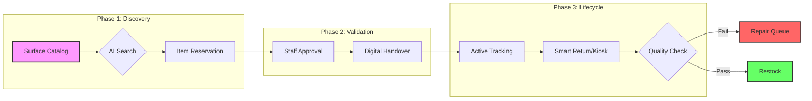
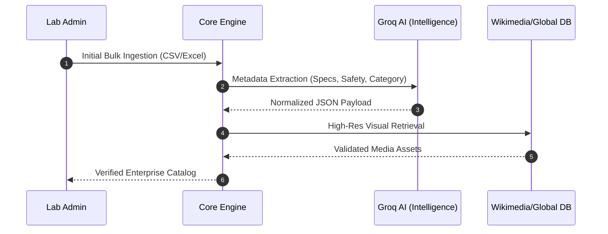

# Strategic Discovery Blueprint: Lab Inventory Pro

> **Building the Digital Lifecycle for Modern Laboratory Ecosystems**

---

## 1. Executive Vision & Objectives

The **Lab Inventory Pro Discovery Phase** is a strategic initiative designed to achieve alignment between cutting-edge technical architecture and complex laboratory operational realities. Our objective is to transition from traditional "static tracking" to a "dynamic asset life-cycle" model.

### 🎯 Strategic Goals

- **Operational Excellence**: Reduce laboratory downtime by 35% through predictive maintenance.
- **Data Integrity**: Establish an immutable "Single Source of Truth" using cryptographic hashing.
- **User Empowerment**: Simplify asset procurement and borrowing via AI-augmented discovery.

---

## 2. Global Stakeholder Matrix

| Category       | Stakeholder          | Mission-Critical Requirements                                | Impact Level |
| :------------- | :------------------- | :----------------------------------------------------------- | :----------- |
| **Strategy**   | Lab Administrators   | Regulatory compliance, auditable history, ROI analytics.     | 🔴 High      |
| **Operations** | Lab Technicians      | Maintenance automation, repair queue health, safety.         | 🔴 High      |
| **Execution**  | Researchers/Students | Instant discovery, zero-friction borrowing, mobile-first UX. | 🟡 Med       |
| **Security**   | IT & Compliance      | RBAC, RLS, SHA-256 data signing, SSO integration.            | 🔴 High      |

---

## 3. High-Fidelity Infrastructure Workflows

### 3.1 The Adaptive Borrowing Cycle

### 3.2 AI-Powered Asset Onboarding (Enrichment Engine)

---

## 4. Technical Feasibility & Scalability Radar

### 🛡️ Core Reliability Stack

- **Persistence Layer**: PostgreSQL with Row-Level Security (RLS) for multi-tenant isolation.
- **Intelligence Layer**: Groq AI integration for sub-second technical enrichment.
- **Security Layer**: Web Crypto API for tamper-evident transaction hashing.
- **Performance Layer**: Vite + React 18 for ultra-fast, responsive interactive dashboards.

### 📈 Scaling Trajectory

- **Short-Term**: University department-wide rollout (500+ items).
- **Mid-Term**: Integration with SAP/Oracle Procurement ERPs.
- **Long-Term**: IoT-integrated "Smart Lab" environment with real-time sensor feedback.

---

## 5. Strategic Risk Mitigation Radar

| Risk Vector                   | Impact   | Mitigation Strategy (The Solution)                                   |
| :---------------------------- | :------- | :------------------------------------------------------------------- |
| **Compliance Drift**          | Critical | Implementation of SHA-256 Digital Certificates on all reports.       |
| **User Onboarding Friction**  | High     | "Kiosk Mode" UI designed for one-handed operation and fast scanning. |
| **Asset Loss (Theft/Damage)** | High     | Real-time notifications and automated student accountability loops.  |
| **Technical Debt**            | Medium   | Micro-frontend architecture to allow modular scaling of features.    |

---

## 6. Advanced Customer Discovery Methodology

### 🧬 Stage 1: The Contextual Inquiry

Moving beyond surveys to **Contextual Observation**. We shadow "Lead Users" (Technicians) to observe manual failures, identifying the "Hidden Friction" that isn't reported in standard feedback.

### 💡 Stage 2: Jobs-to-be-Done (JTBD) Interviews

We interview stakeholders not on "what features they want," but on "what job they are hiring the tool to do."

- **Example**: _"I am hiring Lab Inventory Pro to ensure I never fail another safety audit due to missing chemical logs."_

### 🧪 Stage 3: High-Fidelity Feedback Loops

Using **Interactive Prototypes** (Framer Motion) to test "Kiosk Mode" speed. Success is measured by "Seconds to Action" rather than simple satisfaction.

---

## 7. Success KPIs & ROI Benchmarks

| Metric Category            | Target KPI                        | Verification Methodology                   |
| :------------------------- | :-------------------------------- | :----------------------------------------- |
| **Operational Efficiency** | 40% reduction in checkout time.   | A/B testing: Manual Log vs. Kiosk Mode.    |
| **Data Accuracy**          | 99.9% inventory precision.        | Quarterly automated audit match rates.     |
| **User Sentiment**         | >4.5 CSAT score from Researchers. | In-app pulse surveys and adoption metrics. |

---

## 8. Strategic Roadmap (Revised)

1.  **[Q2] Executive LOIs**: Secure formal partnerships with 3 Regional University Hubs.
2.  **[Q2] Pilot Deployment**: Deploy "Kiosk Mode" to a single high-traffic research lab.
3.  **[Q3] GHS Compliance Certification**: Finalize digital hazardous material tracking features.
4.  **[Q4] Expansion**: Finalize the **Startup Proposal V3** for Series A funding rounds.
